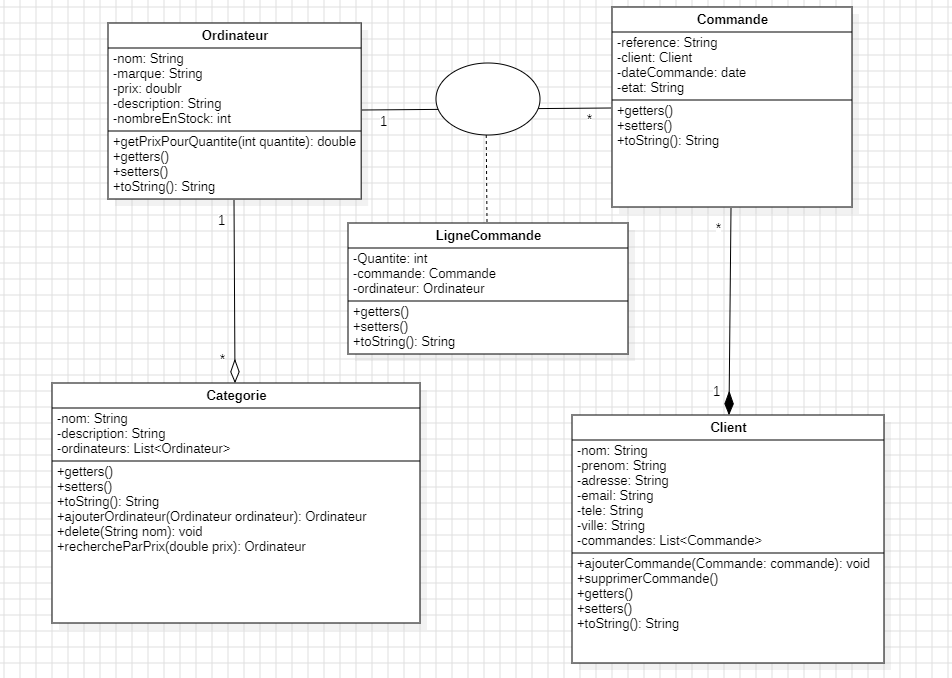

# TP2 : Inheritance,Overriding,Polymorphism,Abstract classes and interfaces

## Description
This repository contains a series of Java exercises focusing on Object-Oriented Programming (POO) concepts, including inheritance, method overriding, polymorphism, abstract classes, and interfaces.

## Exercises Overview

### Exercise 1: Library Management System
- Class **Personne**: Contains private attributes for personal information and a afficher() method to show this information.
- Class **Adherent**: Inherits from Person and adds a numAdherent attribute. It overrides the afficher() method to include the member number.
- Class **Auteur**: Inherits from Person and adds an numAuteur attribute. It also overrides afficher() to include the author number.
- Class **Livre**: Contains an ISBN, a title, and an author (of type Auteur). The afficher() method shows the book's information along with the author’s details.
- Main Class **App**: Tests the classes by creating a member, an author, and a book, and then displaying their information.

### Exercise 2: Company Employee Salary Management
- Abstract Class **Employe**: Contains attributes like **nom**, **prenom**, **email**, **telephone**, and **salaire**, along with constructors and the abstract method **calculerSalaire**() and a afficher() method to show this information.
- Class **Ingenieur**: Inherits from **Employe** and has an attribute **specialite**. Overrides **calculerSalaire**() to **increase** salary by **15%**.
- Class **Manager**: Inherits from **Employe** and has an attribute **service**. Overrides **calculerSalaire**() to increase salary by **20%**.
- Main **App**: Instantiates an **Ingenieur** and a **Manager**, displays their information.

### Exercise 3: Computer Sales Order Management
The objective of this exercise is to design and implement a Java application that manages customer orders for a computer-selling company.
### **Requirements:**
#### Class **Ordinateur**:
- Attributes: name, brand, price, description, and stock quantity.
- Each computer belongs to a category.
- Add a method to return the price for a specified quantity.
#### Class **Categorie**:
- Attributes: name, description, and a list of computers.
- Add a method ajouterOrdinateur() to add a new computer to the list (check if it already exists before adding).
- Add a method supprimerOrdinateur() to remove a computer.
- Add a method rechercherParPrix() that returns a list of computers by a given price.
#### Class **Commande**:

- Attributes: reference, client, date, and order status.
#### Class LigneCommande:

- Attributes: quantity, order, and the ordered computer.
#### Class Client:

- Attributes: name, first name, address, email, city, phone number, and a list of completed orders.
- Add a method ajouterCommande() to add a new order to the list (check if it already exists before adding).
- Add a method supprimerCommande() to remove an order.
#### Class diagram
- 

### Exercise 4: Product Management with Interfaces
This exercise aims to practice managing a collection of objects in Java using lists and interfaces. Specifically, it involves creating a product management system where you:

- Define a **Produit** Class: This class represents a product with attributes such as id, nom (name), marque (brand), prix (price), description, and nombre en stock (stock quantity).

- Create an Interface **IMetierProduit**: This interface defines methods to manage **Produit** objects, including adding, retrieving, searching by name, finding by ID, and deleting products by ID.

- Implement the Interface in **MetierProduitImpl**: This class implements **IMetierProduit** and uses a list to store products. It provides the actual logic for adding, retrieving, and deleting products.

- Create an Application Class: In the main method, create a menu that lets users:

    * View the list of products.
    * Search for products by name keyword.
    * Add a new product.
    * Retrieve a product by ID.
    * Delete a product by ID.
    * Exit the program.
##### The objective is to learn how to structure classes, use interfaces to define behavior, and handle collections in Java effectively, enhancing skills in object-oriented programming and list management.

## Key Concepts Covered
- Inheritance
- Method Overriding
- Polymorphism
- Abstract Classes
- Interfaces
- Collection Management

## Requirements
- Java Development Kit (JDK) 8 or higher
- An Integrated Development Environment (IDE) like Eclipse, IntelliJ IDEA, or NetBeans

## How to Run
1. Clone the repository 
2. Open the project in your preferred Java IDE
3. Compile and run each exercise's main class

    

